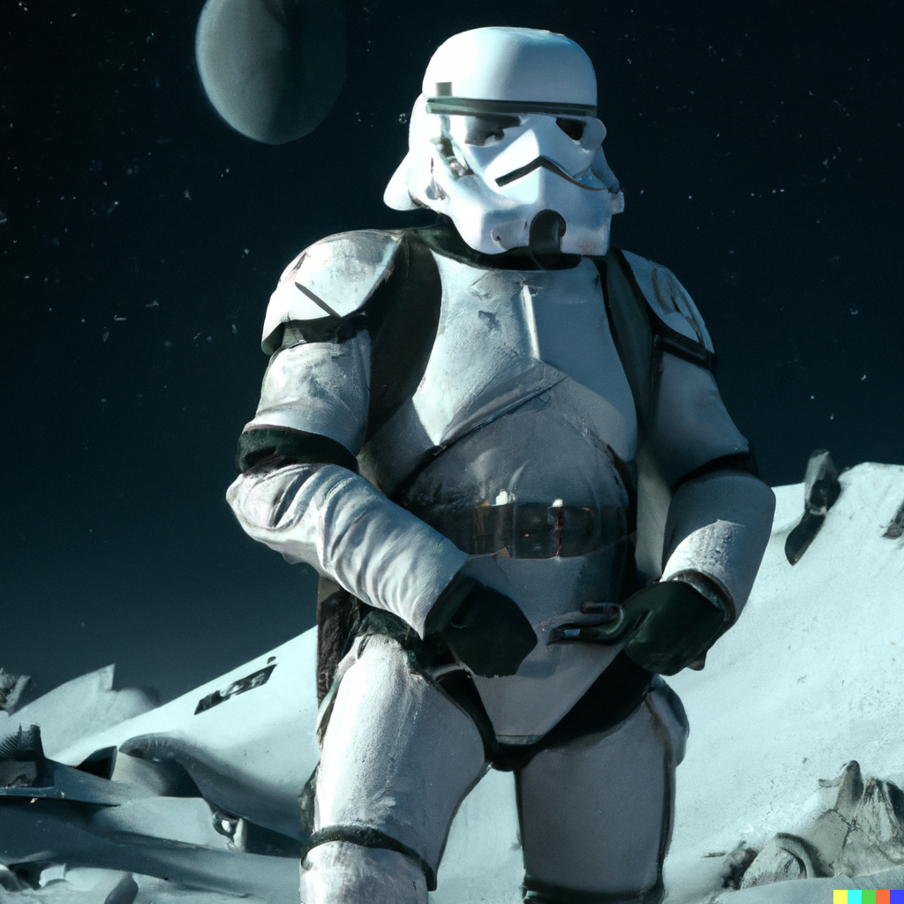

 

Welcome to my GitHub! I'm a Senior Machine Learning Engineer at [Tenstorrent, Inc.](https://tenstorrent.com/) working on [AI hardware accelerators](https://en.wikipedia.org/wiki/AI_accelerator) and [software 2.0](https://karpathy.medium.com/software-2-0-a64152b37c35).

Here is a fun image generated by [DALL·E 2](https://openai.com/dall-e-2/):

<!--
**milank94/milank94** is a ✨ _special_ ✨ repository because its `README.md` (this file) appears on your GitHub profile.

Here are some ideas to get you started:

- 🔭 I’m currently working on ...
- 🌱 I’m currently learning ...
- 👯 I’m looking to collaborate on ...
- 🤔 I’m looking for help with ...
- 💬 Ask me about ...
- 📫 How to reach me: ...
- 😄 Pronouns: ...
- ⚡ Fun fact: ...
-->
